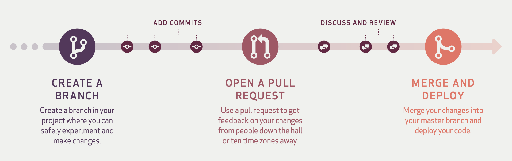
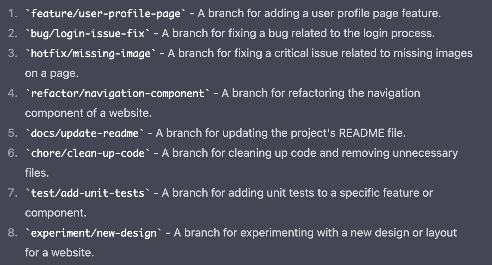

# 1. Git Flow 회고

---

공통 프로젝트에서 우리는 git flow 전략을 활용하고자 했습니다. git flow 전략은 `master`, `develop`, `feature`, `release`, `hotfix` 로 이루어진 5개의 주요 브랜치를 활용하며, 각 브랜치의 개략적인 용도는 그 이름에서 찾아볼 수 있었습니다. 상세한 내용은 기존에 정리해둔 git flow 에 대한 게시글에서 확인할 수 있습니다. 

우리가 활용하고자 했던 git flow 전략의 장단점은 아래와 같았습니다.

***git flow 장점***

- 브랜치별로 책임을 명확히 하는 규칙성
- 디테일한 버전 정보 제공
- master 에 있는 코드는 별도 브랜치에서 테스트를 마친 최종본이기 때문에 깔끔한 상태 유지
- 각 브랜치별로 책임이 명확하므로 문제 발생시 각 브랜치를 대기 시킬 필요가 없음

***git flow 단점***

- 많은 브랜치 때문에 생기는 복잡한 규칙
- release 로 인한 많은 동기화 작업
- 애자일의 반복적인 접근법과 Git-Flow의 엄격하고 구체적인 규칙과 충돌

프로젝트 수행 결과 우리에게 Git Flow 전략은 단점이 장점보다 더 크게 다가왔습니다. 
그 이유는 크게 아래와 같았습니다.

1. ***Git 활용 능력 부족***
    
    프로젝트 수행시 Git을 제대로 사용해본 경험이 없었기 때문에 새로운 브랜치를 생성할때 develop 브랜치로부터 생성하지 않거나 conflict 를 잘못된 방법으로 해결하는 등 실수가 발생했습니다. 이는 새로운 기능을 merge 할때마다 계속해서 많은 conflict 가 발생하게 하였고, 이를 해결하기 위해 많은 시간을 사용해야했습니다. 추가적으로 plugin을 활용하여 강제로 coding convention 따르도록 하는 환경을 구성하지 않았던 것도 반복되는 conflict 를 발생하게 하였습니다.
    
2. ***짧은 개발주기***
    
    우리 프로젝트 기간은 6주로 각 기능들에 대한 개발 주기가 짧은 편해 속해 있었고, feature 브랜치에서 develop 브랜치로, 또 다시 master 브랜치로 병합하는 주기 역시 짧았습니다. 자주 master 브랜치로 병합하게 되면서 여러 규칙을 지키기위한 시간들을 낭비해야했습니다.
    

# 2. Github-Flow 선택

---

공통 프로젝트에서 느꼈던 단점들을 해소하기 위해 우리는 이번 특화 프로젝트에서는 짧은 개발기간동안 `즉각적인 피드백`이 가능하며, `지속적인 배포`에 효과적인 **Github flow** 를 사용하고자 합니다.

## 2.1 Github Flow 란?



Github Flow 의 큰 흐름을 보여주는 그림이고 간략한 내용은 다음과 같습니다. 

1. 기능 개발을 시작할때 master 브랜치로부터 새로운 브랜치를 생성합니다. 
    - 이때 브랜치 이름은 될수있는한 상세하게 작성해야하며 이와 관련한 convention은 뒤쪽에 기술하겠습니다.
    
2. 생성된 브랜치에서 작업 단위로 커밋을 남기며 해당 기능이 최종적으로 완성되었을때 `Pull Request` 를 요청합니다. 
    - `Pull Request`는 GitLab에서 `Merge Request` 로 대체됩니다.
    
3. Open 된 `Merge Request` 에서 리뷰를 진행하고 수정사항이 모두 적용되었을때 master 브랜치로 병합시킵니다.

GitHub-Flow 는 Git-Flow 와 달리 master 브랜치만 주요 브랜치로 사용하고 있습니다. 
이런 방식으로 얻을 수 있는 장단점은 다음과 같습니다.

***Github-Flow 장점***

- 깔끔하고 간단한 규칙
- 지속적인 통합과 개발의 편리함
- 빠른 피드백과 이슈 발행 및 변화 독려
- feature 개발 이후 develop, release 까지 전달할 필요 없음

***Github-Flow 단점***

- Git-Flow 에 비해 체계적이지 않음
- 큰 주기로 배포되는 release 환경에서는 적합하지 않음
- release 준비와 버그 수정이 모두 master 브랜치에서 이루어지므로 각별한 주의가 필요

우리 팀은 이전 프로젝트에서 Git-Flow 전략을 사용했지만, Git 사용 경험이 부족한 우리 팀에게는 복잡한 규칙으로 인한 어려움이 있었습니다. 

따라서, 이번 프로젝트에서는 Github-Flow 전략을 선택했습니다. Github-Flow는 Git-Flow 전략과 달리 master 브랜치만을 주요 브랜치로 사용합니다. 이러한 방식으로 지속적인 통합과 개발이 편리해지며, 빠른 피드백과 이슈 발행 및 변화를 독려합니다.

Github-Flow 전략은 간단한 규칙을 제공하므로 Git에 익숙하지 않은 우리 팀에게 적합합니다. 또한, 짧은 개발 주기 동안 더 빠른 피드백과 이슈 해결이 필요한 상황에서 Github-Flow가 적합하다고 생각합니다. Github-Flow 전략은 Git-Flow 전략에 비해 체계적이지 않은 단점이 있으나, 우리 팀에게는 깔끔하고 간단한 규칙을 제공하는 것이 더욱 적합합니다.

## 2.2 Convention

Github-Flow 를 위한 상세 규칙은 아래와 같습니다.

1. **master 브랜치는 항상 배포가 가능한 상태 유지**
    - master 브랜치는 항상 최신 상태로 배포가 가능하도록 유지
    - 따라서 merge 전 충분한 테스트 진행
        
        (테스트는 로컬이 아닌 jenkins 를 통해 진행해야하지만 이는 우선 생략하도록 하겠습니다.)
        
2. **새로운 기능을 위한 브랜치를 생성할때 명확한 이름 작성**
    - 브랜치는 항상 `master` 브랜치로부터 생성
    - 브랜치 명은 아래와 같은 규칙으로부터 생성해야합니다.
        
    ```
      1. 기능개발시 - feature/fe||be/"개발 기능 내용"
      2. 버그 수정시 - bug/fe||be/"수정하는 버그 내용"
      3. hotfix 시 - hotfix/fe||be/"내용"
      4. 리팩토링 시 - refactor/fe||be/"내용"
      5. 문서 작업 시 - docs/fe||be/"내용"
      6. 파일 구조 변경 시 - chore/fe||be/"내용"
      7. 테스트 작성 시 - test/fe||be/"내용"
        
   🔥 브랜치 이름은 기본적으로 소문자 영어와 '/', '-' 만 사용해주세요.
   🔥 대분류와 기능 사이에 BackEnd 의 be 혹은 FrontEnd 의 fe 를 작성해주세요.
   🔥 위 예시에 포함되지 않는 작업을 수행해야 할때에는 배창민을 호출해주세요.
   ```
        
   
        
    
3. **origin 브랜치로 수시로 push**
    - 항상 원격 브랜치로 자신이 하고 있는 일들을 다른 사람들도 확인할 수 있도록 수시로 push
    
4. **피드백이나 도움이 필요할때, 그리고 merge 준비가 완료되었을때는 pull request(merge request) 생성**
    - pull request 로 부터 코드 리뷰 진행
    - 모든 이슈 해소 및 리뷰가 완료되었다면 merge


💡 commit 에 관련된 convention 은 [Git Commit Convention](Git_Commit_Convention.md) 을 참조해주세요.


# 3. References

[GitHub Flow vs Git Flow](https://escapefromcoding.tistory.com/746)

[GitHub Flow](https://subicura.com/git/guide/github-flow.html#github-flow-방식)

[Git 브랜칭 전략 : Git-flow와 Github-flow](https://hellowoori.tistory.com/56)