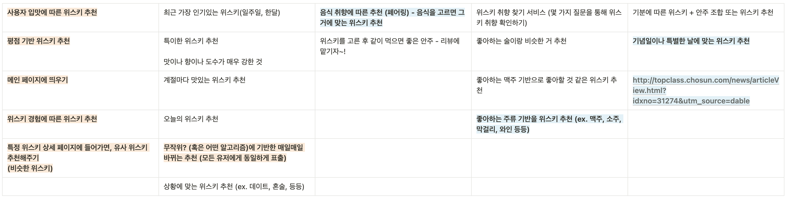
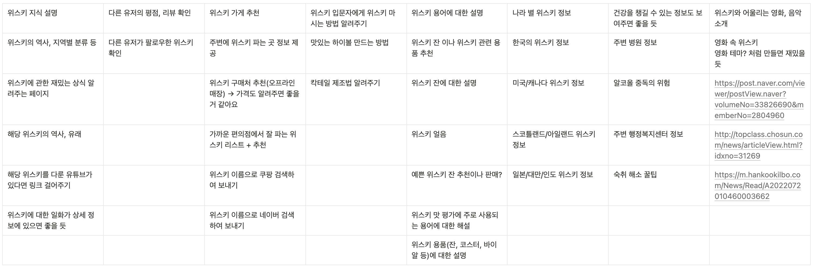
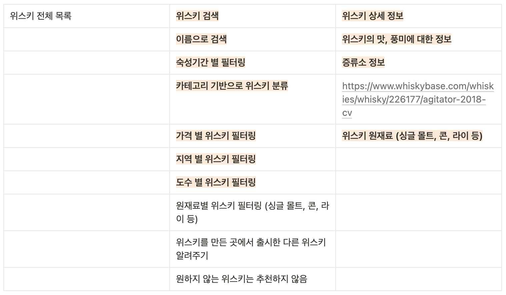
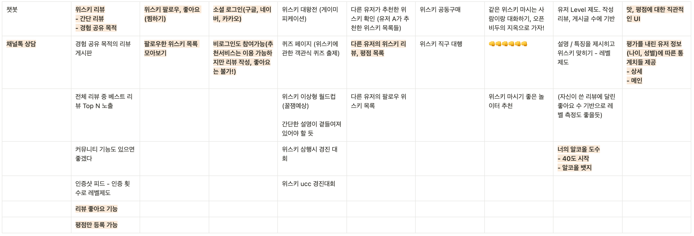

## 회의 안건

---

1. 맥주, 와인, 위스키 중에 우선 하나만 고르기
2. 예상 기능

## 회의 결과

---

### 1. 맥주, 와인, 위스키 중에 우선 하나만 고르기

- 맥주보다는 와인이나 위스키 중에 하나 선택하기
- 와인 vs 위스키 선택은 데이터셋을 보고 결정

  → 데이터 셋에 큰 차이가 없으므로 선호에 따라 `위스키 선택`

### 2. 타겟

1. 입문자 vs 비입문자
    - 추천에서는 크게 고려할 거는 없겠다
2. 댓글 vs 게시글 vs 피드
    - 댓글 vs 피드 : 댓글 승!
    - 게시글은 몇 개의 게시글만 우리가 직접 적어서 메인 페이지에 고정하고 클릭하면 모달로 띄우는 방식으로 접근성 좋게 해두기

### 3. 기능 카테고리 분류

### 추천

### 위스키 : 부가 정보

### 위스키 : 주요 정보

### 사용자 경험

